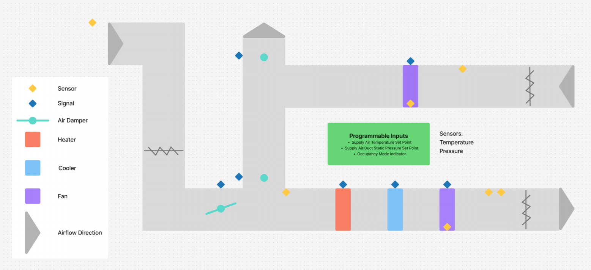
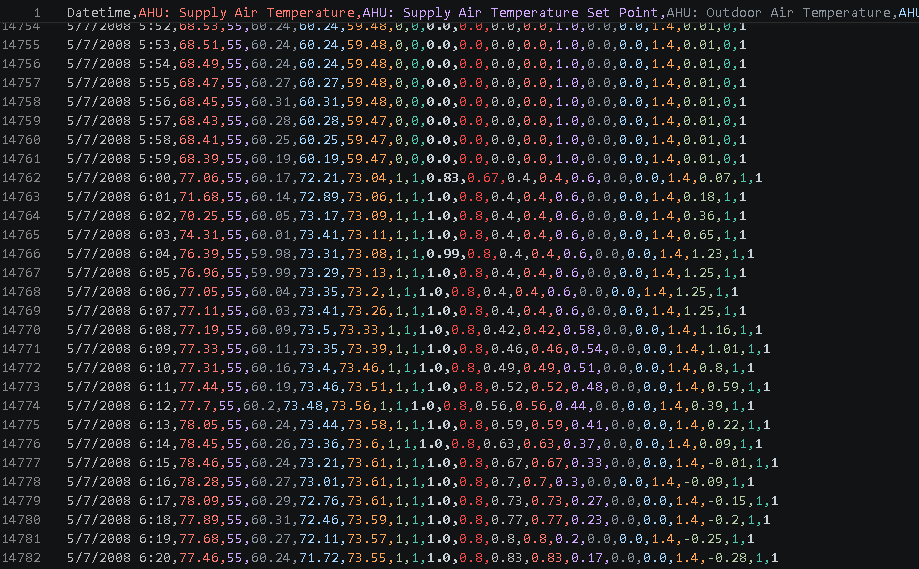
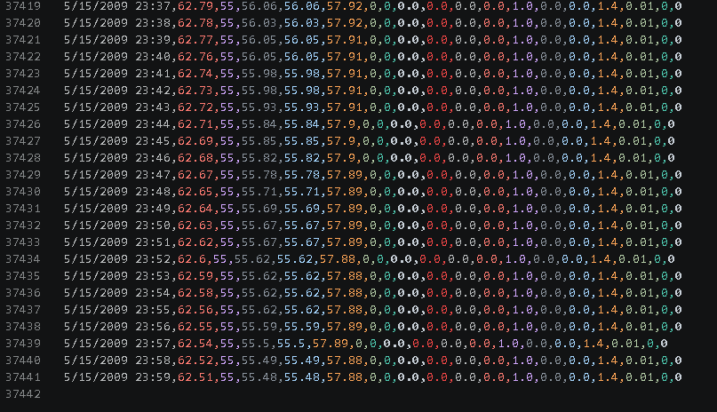
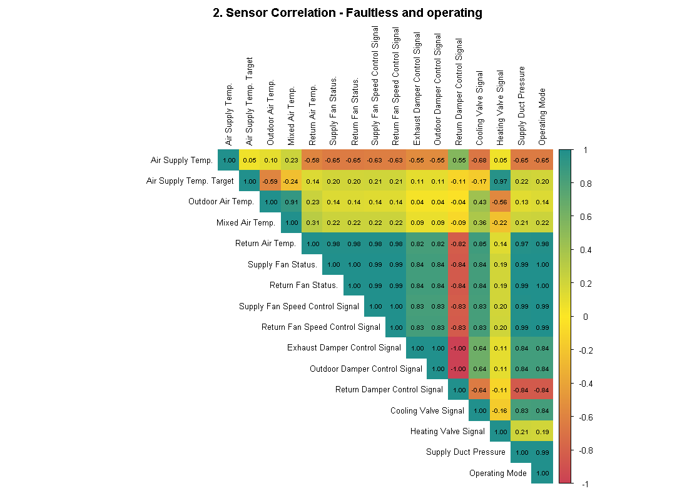
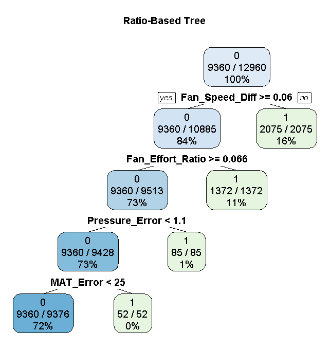

# HVAC Fault Detection: Predictive Maintenance Capstone

## Introduction
Modern Heating, Ventilation, and Air Conditioning (HVAC) systems are highly complex networks of sensors, dampers, valves, and fans. When a component fails, it can waste significant energy or damage the system before human operators notice a problem. 

This project aims to build a robust Machine Learning and Heuristics-based system to automatically detect and classify specific component failures in an Air Handling Unit (AHU) using time-series sensor data. 

### System Schematic
To understand the data, here is a simplified diagram of the HVAC system, showing the airflow, dampers, heating/cooling coils, and sensor placements:



### Dataset Overview
The project utilizes two primary time-series datasets recorded at **1-minute intervals**:
* **Train Set (`MZVAV-2-2.csv`):** 37,441 rows. Contains normal operation data and 3 artificial error types (Damper Stuck, Heating Coil Leak, Cooling Valve Stuck).
* **Test Set (`MZVAV-2-1.csv`):** 21,601 rows. Contains normal operation data and 1 error type (Heating Coil Leak).

**Target Variable Modification:** The original dataset featured a binary `Fault Detection Ground Truth` column (0 = Normal, 1 = Fault). To achieve component-level isolation, I engineered this into a multi-class column (0 = Normal, 1 = Damper, 2 = Cooling, 3 = Heating, etc.).

#### Simulated Fault Structure
To train the models effectively, the training dataset contains artificially induced faults of varying severities. The test set mirrors only the Heating Coil Leak fault to validate the model's ability to generalize.

* **Error 1: Outdoor Air (OA) Damper Stuck**
  * *Stuck Closed:* 2/12/2008, 5/7/2008
  * *Stuck 40% Open:* 5/8/2008
  * *Stuck 45% Open:* 9/5/2007
  * *Stuck 55% Open:* 9/6/2007
* **Error 2: Cooling Coil Valve Stuck**
  * *Fully Open:* 8/31/2007, 5/15/2008
  * *Fully Closed:* 5/6/2008
  * *Partially Open (15%):* 9/1/2007
  * *Partially Open (65%):* 9/2/2007
* **Error 3: Heating Coil Valve Leaking** *(Note: The test set features these exact same faults/dates)*
  * *0.4 GPM Leak:* 8/28/2007
  * *1.0 GPM Leak:* 8/29/2007
  * *2.0 GPM Leak:* 8/30/2007

### Sensor Variables & System Behavior
The dataset consists of continuous analog signals and binary state indicators:
* **Temperatures:** Supply Air, Set Point, Outdoor Air, Mixed Air, Return Air.
* **Control Signals & Fan Speeds:** Supply/Return Fan Speed Control, Exhaust/Outdoor/Return Damper Control, Cooling/Heating Valve Control.
* **Pressures:** Supply Air Duct Static Pressure, Pressure Set Point.
* **Binary Indicators:** Supply/Return Fan Status, Occupancy Mode Indicator.

**System Dynamics (The 6 AM Shift):** The most drastic changes in the dataset occur when the `Occupancy Mode Indicator` switches from `0` to `1` (typically at 6:00 AM). This triggers the fans and temperature control loops to activate, which is when faults become mathematically visible.





---

## Project Goal & Strategy
The objective is to ingest a full day's worth of data and generate a diagnostic report for maintenance teams, pinpointing the exact location of the failure.

1. **Data Exploration:** Analyze sensor stability, system cycles, and identify heuristic baseline rules.
2. **Feature Engineering:** Calculate physical relationship metrics (e.g., Fan Effort Ratios, Heat/Cool mismatches) and smooth data with a 6-minute rolling average.
3. **Model Training:** Train Decision Trees and Random Forests to detect individual, localized faults.
4. **System Refinement:** Shift from row-by-row prediction to daily aggregation to eliminate noise and false positives.
5. **Hybrid Architecture:** Combine translated ML Trees with hard-coded logic for robust reporting.

---

## Phase 1: Establishing a "Steady-State" Baseline & Heatmaps
Initial data exploration showed that the HVAC signals reset every night. To understand true baseline operations, I needed to look at the system when it was completely stable. 

I generated a highly engineered correlation heatmap by doing two things:
1. **Filtering out all simulated faults**, leaving only completely healthy data.
2. **Skipping the first 60 minutes** of every occupancy shift (e.g., from 6:00 AM to 7:00 AM) to allow temperatures and fans to reach a steady state, completely removing startup noise.



By doing this, I established absolute mathematical relationships. Because of this rigorous filtering, I knew that if a perfect 1.0 correlation broke in the future, it was definitively a mechanical fault, not just a system warming up or a sensor calibrating.

---

## Phase 2: The Modeling Journey & Challenges

My initial plan was to detect errors from easiest to hardest: Damper Position -> Cooling Valve Stuck -> Heating Coil Leak.

### 1. Damper Stuck (Error 1)
Using raw temperatures in a decision tree resulted in an overfitted model that only worked under highly specific weather conditions. To fix this, I used a Random Forest regression model to extract feature importance. 

*Insight:* Raw temps are less important than the **relationships** between systems. I engineered new ratio columns: *Fan Speed Difference, Pressure Error, and Mixed Air Temp (MAT) Error.* Training the tree with a custom loss matrix resulted in a clean, robust decision tree.



### 2. Cooling Valve Stuck (Error 2)
The simple tree initially failed (268/3600 incorrect). Allowing the tree to expand showed heavy reliance on "Cooling Valve Efficiency." I engineered an additional contextual column: a time-based counter tracking how long the system had been continually active.

### 3. Heating Valve Leak (Error 3) - The Trouble Child
Logically, a massive 2.0 GPM leak should be easiest to detect, and a 0.4 GPM leak the hardest. Surprisingly, the model struggled the most with the intermediate 1.0 GPM leak. 

### The Engineering Pivots: Why Plan A Failed
My original plan (Plan A) was to train machine learning models to analyze the data row-by-row, minute-by-minute. 
* **The Overfitting Issue:** Predicting faults on a 1-minute basis resulted in models that were far too sensitive. A 3-minute sensor calibration delay would trigger a false positive.
* **The Translation Nightmare:** I originally trained complex Decision Trees in R. Attempting to translate precise R-based tree cutoff points into Python `if/else` statements for a row-by-row analysis was a workflow nightmare. Furthermore, when combining multiple fault models, their logic overlapped, causing the models to conflict with each other.

---

## Phase 3: The Breakthrough (Daily Aggregation & Physics Rules)

**Plan B (The Final Architecture):** I abandoned the row-by-row approach. Instead, I shifted to a **Daily Aggregation Model**. By skipping the first 60 minutes of the day and aggregating the rest of the shift into a single summary row, the models could look at the *macro-behavior* of the day. This completely eliminated false positives caused by minute-by-minute noise.

### Compressing the Day: Column Logic & Physics
To summarize a 10-hour work shift into a single row, the script applies a `groupby("Occ_Block")` function on the steady-state data. The final "digested" dataset consists of 10 aggregated feature columns. These are divided into two categories: **Engineered Physics Metrics** and **Smoothed Sensor States**.

**Category 1: Engineered Physics Metrics**
Raw temperatures aren't always useful to a model, so I engineered contextual columns to measure system effort before aggregating them:
* `Pressure_Error_mean`: *(Actual Static Pressure - Set Point)*. Measures if the system is failing to meet pressure requirements on average.
* `Fan_Effort_Ratio_mean`: *(Static Pressure / Fan Speed)*. Measures how hard the fan has to spin to generate pressure. If the fan is at 100% but pressure is low, air is leaking or blocked.
* `MAT_Error_p95`: *(Actual MAT - Ideal MAT)*. (Ideal MAT is calculated using Outdoor/Return temps and damper percentages). If this error is high at the 95th percentile, the damper is stuck and physically lying about its position.
* `Over_Cooling_Error_mean`: *(Set Point - Supply Temp)*. Measures how far the air is overshooting the target coldness.
* `Heating_Demand_Mismatch_p95`: *(Heating Valve % * (Set Point - Supply Temp))*. Calculates if the heater is working extremely hard to heat up air that is freezing cold, proving the heating and cooling systems are fighting each other.
* `Fan_Mismatch_Error_mean`: A binary check comparing Fan Command vs Fan Status. Aggregated as a mean, it tells us the percentage of the day the hardware was disagreeing with the software.

**Category 2: Smoothed Sensor States**
I also passed through several smoothed raw sensors (using a 6-minute rolling average) and calculated their daily mean. These were necessary for the hard-coded Heuristic rules:
* `Roll_Cool_Valve_mean`: The daily average % the cooling valve was open.
* `Roll_Heat_Valve_mean`: The daily average % the heating valve was open.
* `Roll_Supply_Temp_mean`: The daily average temperature of the air supplied to the rooms.
* `Roll_Set_Point_mean`: The daily average target temperature.
*(Logic: These four columns allow the script to ask simple questions like: "Is the supply temp way higher than the set point while the cooling valve is sitting at 0%?" -> Control Loop Failure).*

**The Aggregation Logic (`mean` vs `p95`):**
When collapsing these minute-by-minute calculations into a daily summary, I used `.mean()` to capture the *average state* of continuous signals (like valve positions). However, for error spikes (like Temperature Mismatches), I used `.quantile(0.95)` (the 95th percentile). This ensures that a single 1-minute anomaly is ignored, but a sustained error throughout the day is caught.

### Hybrid Architecture: ML meets Heuristics
The final Python code is not just a copy-paste of a Machine Learning Decision Tree; it is a hybrid system. 
1. **Machine Learning Logic (The Hidden Faults):** For complex problems—like determining exactly *when* a damper is stuck or predicting a slow 1.0 GPM hot-water leak—I used the thresholds generated by the ML Decision Trees. The models found the perfect ratios (e.g., Fan Effort vs Pressure) that indicate a fault.
2. **Custom Heuristics (The Mechanical Faults):** For direct mechanical failures, I didn't need ML. I wrote custom `if/elif` rules derived directly from the steady-state correlation heatmap. For example, Fan Command and Fan Status must have a 1.0 correlation. If they don't, it is a guaranteed hardware fault (Fault 4).

### Why the System is Robust to Glitches (Margin of Error)
In real-world HVAC systems, sensors drift and hardware lags. If an error threshold is based on a razor-thin margin (e.g., 0.001 degrees), the system will fail in production. This architecture ensures a massive safety buffer in three ways:

1. **Time Tolerance via Percentiles:** By using `MAT_Error_p95` instead of `MAT_Error_max`, the system requires an error to be sustained for at least 5% of the day (roughly 30 minutes) before the threshold can be triggered. 
2. **Wide ML Thresholds:** The model learned wide, definitive boundaries. For example, the `Heating_Demand_Mismatch` threshold is `> 9.62`. This isn't a tiny calibration glitch; a value of 9.62 means the system is drastically and continuously fighting itself.
3. **Hardware Forgiveness:** The Fan Mismatch rule requires the `Fan_Mismatch_Error_mean` to be `> 0.1`. Because this is a daily average of binary states (0 or 1), the command and status must disagree for **more than 10% of the entire day** to trigger a fault. A 5-minute delay while the fan spins up will never trigger a false alarm.

### The Logic Behind the Trees (In Simple Terms)

Once the data is daily-aggregated, the Machine Learning models translate into beautifully simple physical rules:

#### **Damper Fault Logic**
```text
|--- Fan_Effort_Ratio_mean <= 1.05  --> FAULT
|--- Fan_Effort_Ratio_mean > 1.05
|   |--- Pressure_Error_mean > 1.13
|   |   |--- MAT_Error_p95 <= 2.41  --> FAULT
```
* **What this means:** The `Fan_Effort_Ratio` checks how hard the fan is working compared to the pressure it generates. If the fan is spinning fast but pressure isn't building, the damper is stuck in the wrong position, leaking or blocking air. If the system manages to maintain perfect temperatures (`MAT_Error <= 2.41`) but has terrible pressure errors, it means the HVAC is brute-forcing the fans to mask the stuck damper.

#### **Cooling Fault Logic**
```text
|--- Heating_Demand_Mismatch_p95 > 9.62      --> FAULT
|--- Over_Cooling_Error_mean <= -15.68       --> FAULT
```
* **What this means (The Thermostat Fight):** If the heating valve is wide open, but the supply air is still freezing cold (`Heating_Demand_Mismatch`), the heater is actively fighting a cooling valve that is stuck open. Conversely, if the air is way too cold (`Over_Cooling_Error`), the cooler is stuck on. (A secondary rule was added for when the room is too hot, but the cooling valve refuses to open at all).

#### **Heating Fault Logic**
```text
|--- Roll_Cool_Valve_mean > 0.49   --> FAULT
```
* **What this means:** If the cooling valve is forced to stay 50% open *on average for the entire day*, it's because it is secretly fighting a continuous hot-water leak from the broken heating coil just to keep the room at a normal temperature.

---

## Final Results

The final hybrid system was tested on the combined dataset. While not every simulated fault could be perfectly replicated in the test environment, the system successfully identified faults with **zero false positives**.

**Training Set Confusion Matrix:**
| Actual \ Predicted | 0: Normal | 1: Damper | 2: Cooling | 3: Heating | 4: Fan HW | 5: Low Press | 6: High Press |
| :--- | :---: | :---: | :---: | :---: | :---: | :---: | :---: |
| **0: Normal** | 12 | 0 | 0 | 1 | 0 | 0 | 0 |
| **1: Damper** | 0 | 5 | 0 | 0 | 0 | 0 | 0 |
| **2: Cooling** | 0 | 0 | 5 | 0 | 0 | 0 | 0 |
| **3: Heating** | 0 | 0 | 0 | 3 | 0 | 0 | 0 |

**Test Set Confusion Matrix:**
*(Note: 2 False positives on Heating were analyzed and traced back to extreme weather days where return air was vastly warmer than supply air, tricking the system).*

| Actual \ Predicted | 0: Normal | 1: Damper | 2: Cooling | 3: Heating | 4: Fan HW | 5: Low Press | 6: High Press |
| :--- | :---: | :---: | :---: | :---: | :---: | :---: | :---: |
| **0: Normal** | 11 | 0 | 0 | 2 | 0 | 0 | 0 |
| **1: Damper** | 0 | 0 | 0 | 0 | 0 | 0 | 0 |
| **2: Cooling** | 0 | 0 | 0 | 0 | 0 | 0 | 0 |
| **3: Heating** | 0 | 0 | 0 | 2 | 0 | 0 | 0 |

---

## Lessons Learned
* **Machine Learning Logic vs. Human Logic:** Intermediate faults (e.g., the 1.0 leak) can sometimes be harder for a model to detect than extreme ends of the spectrum.
* **Tech Stack Consistency:** Translating trained models across languages (R to Python) manually is highly inefficient. Future ML workflows should be kept natively in Python end-to-end.
* **Theory vs Reality:** Training data often has razor-thin boundaries between classes. Real-world data requires broader tolerances. Grouping data in daily chunks saved the project from sensor-glitch false positives.
* **Organization:** Version control and strict folder organization are vital when experimenting with dozens of scripts, datasets, and iterations.
* **Simplicity First:** Start with a humble, scalable foundation. Only introduce complexity when necessary.

## Future Improvements (Project Conclusion)
The final system successfully acts as a "daily log parser" that tells maintenance teams exactly where to look for an error. 

If I were to deploy this in production, I would split it into a **Two-Tier System**:
1. **Tier 1 (Critical - Rule-Based):** Hard-coded logic (valves, fan status, pressure loss) running on a rolling 30-minute window to immediately flag catastrophic mechanical failures.
2. **Tier 2 (Non-Critical - ML Based):** Machine learning models (predicting slow leaks, damper sticks) running on a 24-hour delay. These faults don't cause immediate danger but waste energy, and analyzing them over a full day eliminates false positives.
